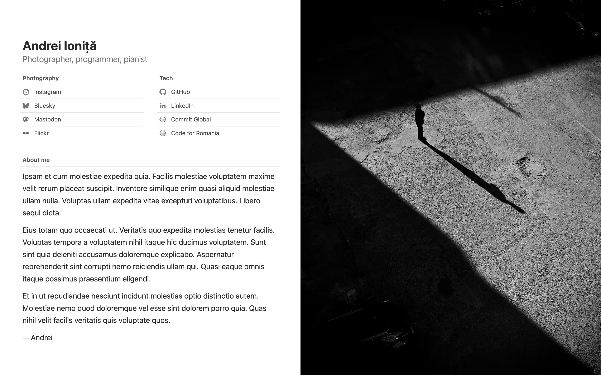

# andrei.io – v3

The thrid iteration of [andrei.io](https://andrei.io), built with [Astro](https://astro.build/) and [Tailwind CSS](https://tailwindcss.com/) and hosted on [Netlify](https://www.netlify.com/).

Previous versions:
- [v1](https://github.com/andreiio/andrei.io/tree/v1)
- [v2](https://github.com/andreiio/andrei.io/tree/v2)

## 🧞 Commands

All commands are run from the root of the project, from a terminal:

| Command                   | Action                                           |
| :------------------------ | :----------------------------------------------- |
| `npm install`             | Installs dependencies                            |
| `npm run dev`             | Starts local dev server at `localhost:4321`      |
| `npm run build`           | Build your production site to `./dist/`          |
| `npm run preview`         | Preview your build locally, before deploying     |
| `npm run astro ...`       | Run CLI commands like `astro add`, `astro check` |
| `npm run astro -- --help` | Get help using the Astro CLI                     |
